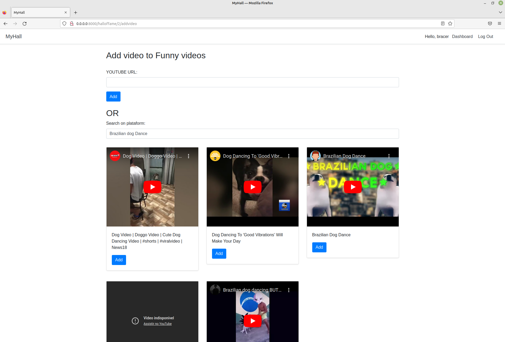

# My Hall!
> Share your favorite video with your friends!

 

This is a video plataform where the user can add his favorite videos and share with the whole world (if deployed)

## Installation

<ol>
    <li>Install Docker and Docker-compose on your machine</li> 
    <li>Create a .env file to alocate your environment variables</li> 
    <li>Open your terminal and type:</li>
    <code>make build</code>
</ol>

### OBS

>#### To run this repository on your computer, is required a Youtube Api key (https://console.cloud.google.com/) and a MySQL database server (https://www.mysql.com/products/workbench/)

>#### When linking your database to the repo, your host is "database" (local.yml -> services -> database)

>#### After build the images, it will be stored on your PC, so if you want to remove their copy and paste this on terminal: 
 

    docker container stop WebService WebDatabase && docker container rm WebService WebDatabase

 

## How to use it

<ol>
    <li>If you want to add videos to the plataform, first type in your terminal:</li> 
    <code>make docker-createsuperuser</code>
      
    <li>Click <a href="http://0.0.0.0:8000/">Here</a></li>
</ol>

  

## Meta 
 

<h2> Guilherme Bracero Gonzales </h2>

 

LinkedIN - [Guilherme Bracero](https://www.linkedin.com/in/guilherme-bracero/)
 
Instagram - [Bracero](https://instagram.com/guilhermebracero)
 
Email - [guibragon@gmail.com](www.gmail.com) 

